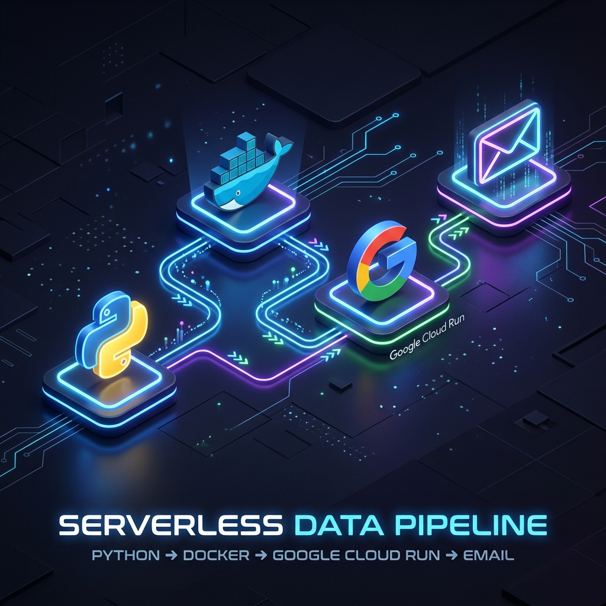
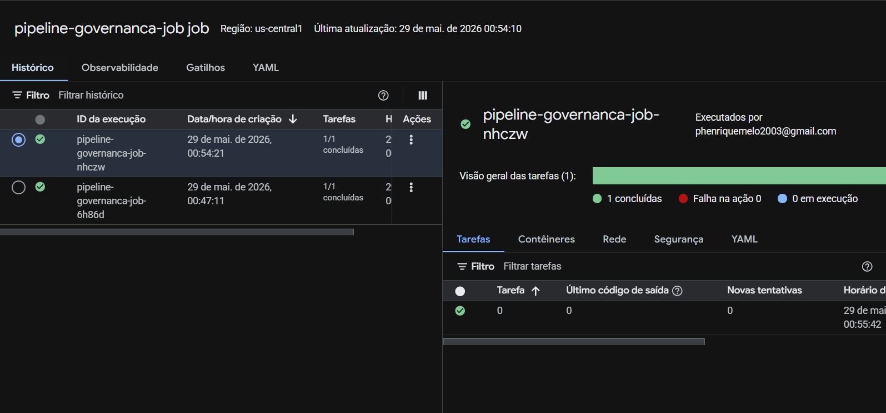
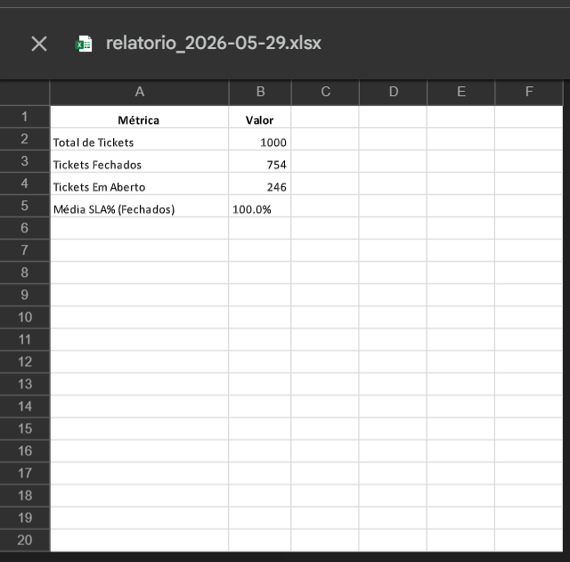

<div align="center">
  
</div>

# Pipeline de Governança de TI - Serverless 🚀

Um pipeline autônomo, construído em Python, para processar dados de chamados de TI (ITSM), calcular métricas de qualidade e eficiência (SLA, tempo de resolução, volume por categoria) e enviar relatórios consolidados em Excel via e-mail. Tudo orquestrado de forma serverless na nuvem.

## 📸 Galeria do Projeto

*(Adicione suas screenshots na pasta `assets` com os nomes abaixo para que elas apareçam aqui!)*

### Arquitetura rodando no Google Cloud (GCP)

*Dashboard do Google Cloud Run mostrando o serviço online e os logs de execução.*

### O Código Fonte (Python Modular)

*Estrutura modular do pipeline, separando leitura, processamento e envio de e-mails.*

### O Resultado Final (Planilha Gerada)

*Planilha rica em detalhes gerada dinamicamente pelo Pandas e OpenPyXL.*

---

## 🛠️ Stack Tecnológica

- **Linguagem:** Python 3.12
- **Processamento de Dados:** Pandas
- **Geração de Relatórios:** OpenPyXL
- **Testes:** Pytest
- **Infraestrutura/Nuvem:** Google Cloud Run (Serverless)
- **CI/CD & Containerização:** Docker, Google Cloud Build, Artifact Registry

## ⚙️ Arquitetura do Projeto

O projeto foi refatorado adotando os princípios de **Clean Code** e **Modularidade**, separando a lógica em componentes específicos:

- `src/simulator.py`: Gera tickets falsos aleatórios para simular o banco de dados do ITSM.
- `src/reader.py`: Responsável pela ingestão de dados.
- `src/processor.py`: Motor de análise de dados com `Pandas` (Métricas, Categorias e Rankings).
- `src/exporter.py`: Consolida a visualização formatada em planilhas Excel.
- `src/mailer.py`: Automatiza o envio seguro via SMTP.
- `src/main.py`: O orquestrador principal do pipeline.

## 🚀 Como Executar

### Localmente

1. Clone o repositório.
2. Crie um ambiente virtual: `python -m venv venv`
3. Instale as dependências: `pip install -r requirements.txt`
4. Configure o arquivo `.env` (use o `.env.example` como base).
5. Execute: `python src/main.py`

### Na Nuvem (Google Cloud Run)

O deploy foi containerizado e preparado para rodar no Google Cloud Run:

```bash
# 1. Deploy da Imagem
gcloud run jobs deploy pipeline-governanca-job --source . --region us-central1

# 2. Configurar Variáveis de Ambiente (Segurança)
gcloud run jobs update pipeline-governanca-job --region us-central1 --set-env-vars EMAIL_SENDER="seu_email",EMAIL_RECIPIENT="seu_email",EMAIL_PASSWORD="senha_app"

# 3. Executar o Job
gcloud run jobs execute pipeline-governanca-job --region us-central1
```

## 🔒 Segurança Aplicada
- Senhas e tokens nunca são comitados graças ao `.gitignore` e `.gcloudignore`.
- O Cloud Run usa variáveis de ambiente isoladas em runtime.
- Autenticação de e-mail feita via App Passwords do Google, bloqueando acessos indevidos.
